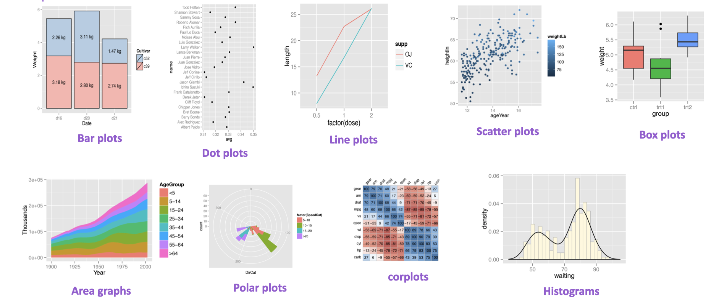
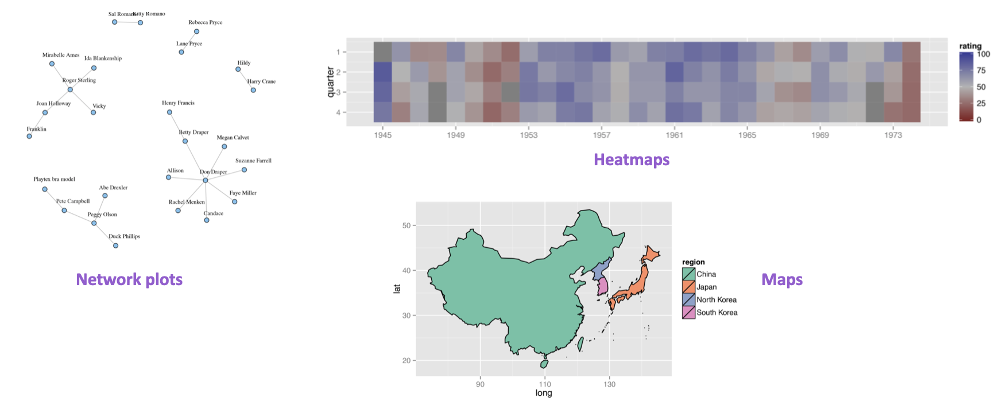
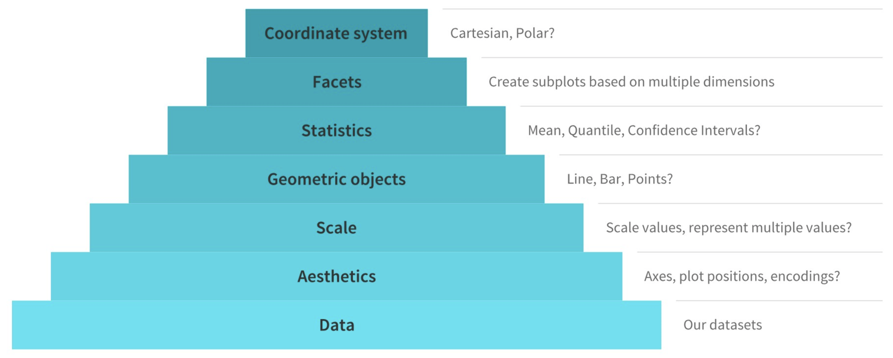
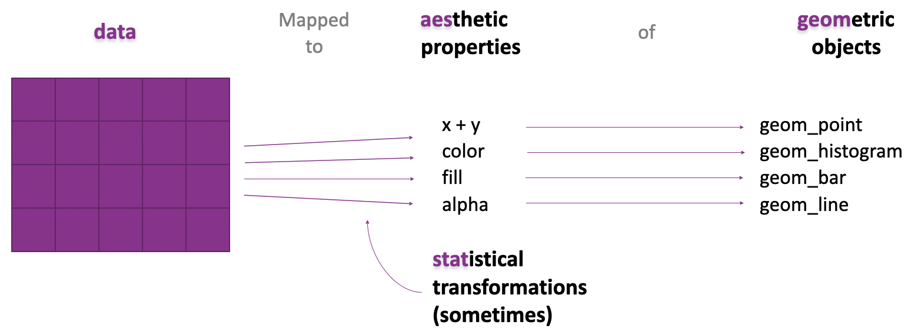
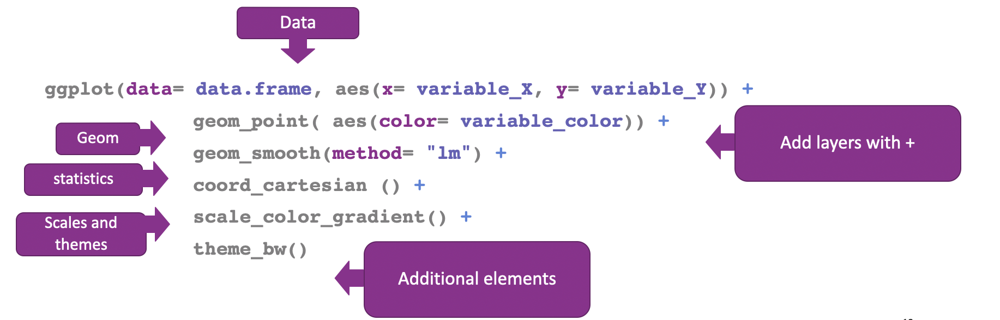

```{r xaringanExtra-clipboard, echo=FALSE}
xaringanExtra::use_clipboard()
```

# The ggplot2 package


.left-column[
```{r, echo=FALSE, out.width='100%', fig.align='center'}
knitr::include_graphics("img/ggplot.png")
```
]

.right-column[
- Part of the tidyverse
- Based on "The grammar of graphics" (Leland Wilkinson, 2000)
- Structured syntaxis based on layers
- 110 registered extensions https://exts.ggplot2.tidyverse.org/gallery/
  - gganimate
  - ggthemes
  - ggpubr
]

---
# Some example plots made with ggplot2

```{r, echo=FALSE, out.width='110%', fig.align='center'}

```
.center[
Image from [Godoy, 2021](https://github.com/RLadiesMX/minicurso_nov_2021)
]

---
# Some example plots made with ggplot2

```{r, echo=FALSE, out.width='110%', fig.align='center'}

```
.center[
Image from [Godoy, 2021](https://github.com/RLadiesMX/minicurso_nov_2021)
]

---
# Major components of the Grammar of Graphics

```{r, echo=FALSE, out.width='110%', fig.align='center'}

```
.center[
Image from [Carpentry Lessons](https://scienceparkstudygroup.github.io/r-lesson-based-on-ohi-data-training/03-ggplot2/index.html)
]

---

# Map and plot data
<br>

```{r, echo=FALSE, out.width='110%', fig.align='center'}

```
.center[
Image from [rfortherestofus](https://rfortherestofus.com/2019/07/a-short-overview-of-the-grammar-of-graphics/
)
]

---
# Syntaxis of ggplot2
<br>

```{r, echo=FALSE, out.width='110%', fig.align='center'}

```

---
# Our first ggplot

- Read the data
```{r, message=FALSE, warning=FALSE}
library(tidyverse)
library(janitor)

sinai_covid <- read_csv("sinai_covid.csv")

sinai_covid <- sinai_covid %>% 
  clean_names()
```

---

- ggplot() will start a blank canvas

```{r, out.width='45%', fig.align='center'}
ggplot()
```

---
- Add the data to plot

```{r, out.width='50%', fig.align='center'}
ggplot(sinai_covid)
```

Still a blank canvas

---

- Add the aesthetics properties

```{r, out.width='45%', fig.align='center'}
ggplot(sinai_covid, 
       aes(x = age, y = systolic_bp))
```

Still a blank canvas, with axis

---
- Add the geometric objects

```{r, out.width='45%', fig.align='center'}
ggplot(sinai_covid,
       aes(x = age, y = systolic_bp)) +
  geom_point()
```

We got a scatterplot!

---
# Plotting 1 variable (num)

```{r, out.width='45%', fig.align='center', message=FALSE, warning=FALSE}
ggplot(sinai_covid, aes(x = age)) +
  geom_histogram()
```

---
# Plotting 1 variable (cat)

```{r, out.width='45%', fig.align='center', message=FALSE, warning=FALSE}
ggplot(sinai_covid, aes(x = sex)) +
  geom_bar()
```

---

# Your turn!

- Plot the distribution of systolic_bp
- Plot the number of patients depending on their smoking status

---

# Plotting 2 variables (num-num)

```{r, out.width='40%', fig.align='center', message=FALSE, warning=FALSE}
ggplot(sinai_covid, 
       aes(x = systolic_bp, y = diastolic_bp)) +
  geom_point()
```

---

# Plotting 2 variables (cat-num)

```{r, out.width='30%', fig.align='center', message=FALSE, warning=FALSE}
ggplot(sinai_covid, 
       aes(x = facility, y = age)) +
  geom_point()
```

No so good...

---

# Plotting 2 variables (cat-num) - Much better!

```{r, out.width='40%', fig.align='center', message=FALSE, warning=FALSE}
ggplot(sinai_covid, 
       aes( x = age, y = facility,)) +
  geom_boxplot()
```

---
# Your turn!

- Plot the variables age vs bmi
- Plot the distribution of patient's bmi from the different facilities

---

# Plotting 3 variables (num-num-cat)

```{r, out.width=350, out.height=200, fig.align='center', message=FALSE, warning=FALSE}
ggplot(sinai_covid, 
       aes(x = systolic_bp, 
           y = diastolic_bp,
           color = facility)) +
  geom_point()
```

---
# Plotting 3 variables (num-num-cat)

```{r, out.width=350, out.height=200, fig.align='center', message=FALSE, warning=FALSE}
ggplot(sinai_covid,
       aes(x = systolic_bp, 
           y = diastolic_bp,
           shape = sex)) +
  geom_point()
```

---
# Let's practice

- Plot the patient's age vs bmi, and separate by color or shape based on their smoking status

---
# Plotting 3 variables (num-num-num)

```{r, out.width=350, out.height=200, fig.align='center', message=FALSE, warning=FALSE}
ggplot(sinai_covid, 
       aes(x = systolic_bp, 
           y = diastolic_bp,
           color = age)) +
  geom_point()
```

---
# Plotting 3 variables (cat-cat-num)

```{r, out.width=300, out.height=150, fig.align='center', message=FALSE, warning=FALSE, out.height=200, eval=FALSE}
count_smoking <- sinai_covid %>% 
  group_by(facility) %>% 
  count(smoking_status)

ggplot(count_smoking, 
       aes(x = smoking_status,
           y = facility,
           size = n)) +
  geom_point()
```
---

# Plotting 3 variables (cat-cat-num)
```{r,out.width='50%', fig.align='center', message=FALSE, warning=FALSE, echo=FALSE}
count_smoking <- sinai_covid %>% 
  group_by(facility) %>% 
  count(smoking_status)

ggplot(count_smoking, 
       aes(x = smoking_status,
           y = facility,
           size = n)) +
  geom_point()
```
---
# Plotting 3 variables (cat-cat-num)

```{r, out.width='30%', fig.align='center', message=FALSE, warning=FALSE}
ggplot(count_smoking, 
       aes(x = smoking_status, 
           y = facility,
           size = n, color = n)) +
  geom_point()
```
---

# Let's practice

- Count the number of patients with chronic kidney disease per facility and plot the data

---
.pull-left[<br><br><br><br><br><br><br>
.center[
# Thanks!
]
]

.pull-right[<br><br><br><br>
```{r,echo=FALSE,out.width='100%',fig.align='center'}
knitr::include_graphics("img/thanks.png")
```

.pull-right[Ilustration by Allison Horst]
]
